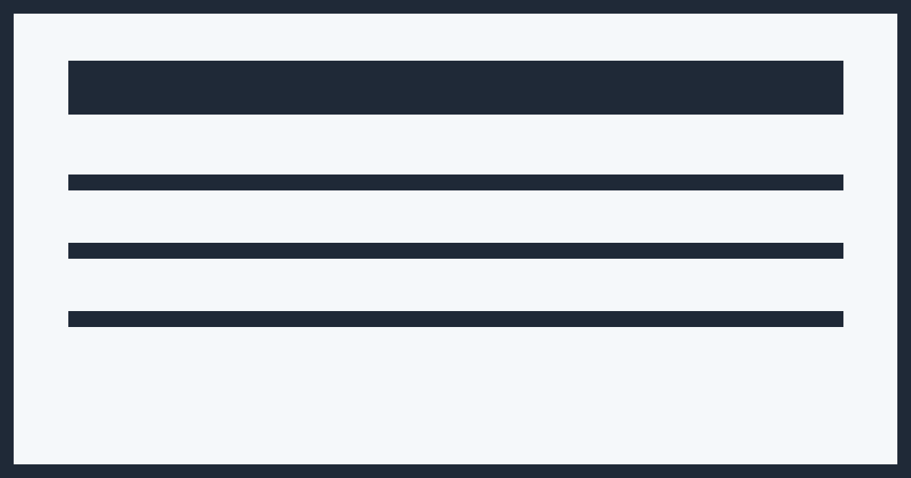

# Relay

Relay é uma plataforma full stack para processamento assíncrono de eventos, construída com FastAPI, RabbitMQ, PostgreSQL, Redis, React, Docker e uma stack completa de observabilidade.

O projeto demonstra como uma aplicação pode receber eventos, persistir estado de forma confiável, processar mensagens por domínio e oferecer visibilidade operacional sobre falhas, retries, DLQ, métricas, logs e traces.

## Tecnologias

| Área | Tecnologias |
| --- | --- |
| Backend | Python, FastAPI, SQLAlchemy, Alembic, Pydantic |
| Frontend | React, TypeScript, Vite |
| Mensageria | RabbitMQ, topic exchange, DLX, retry queues |
| Dados | PostgreSQL, Redis |
| Observabilidade | Prometheus, Grafana, OpenTelemetry, Tempo, Loki, Alloy, Alertmanager |
| Infra | Docker Compose, Nginx |

## Problema

Sistemas orientados a eventos precisam publicar mensagens com segurança, processar cargas assíncronas sem duplicidade e oferecer uma forma clara de investigar falhas. O Relay simula esse cenário com uma arquitetura próxima de produção, separando API, publicação confiável, workers por domínio e ferramentas de operação.

## Funcionalidades

- Criação e listagem de eventos.
- Publicação confiável com Transactional Outbox.
- Processamento assíncrono por domínio.
- Retry com backoff progressivo.
- Dead Letter Queue com inspeção e reprocessamento manual.
- Consumers idempotentes.
- Correlação por `correlation_id` e `trace_id`.
- Dashboard web com visão operacional, filtros, paginação, detalhes de evento e operação da DLQ.
- Autenticação JWT simples para a interface operacional.
- CI com validação de backend, frontend e Docker Compose.
- Métricas, logs, tracing distribuído e alertas.

## Arquitetura

```text
API -> PostgreSQL + Outbox -> Outbox Publisher -> RabbitMQ -> Workers -> Retry/DLQ -> Observability Stack
```



## Como Executar

```bash
cp .env.example .env
docker compose up --build
```

URLs principais:

- Aplicação: http://localhost
- API: http://localhost:8000
- Health check: http://localhost/health
- RabbitMQ Management: http://localhost:15672
- Prometheus: http://localhost:9090
- Alertmanager: http://localhost:9093
- Grafana: http://localhost:3000

Credenciais locais padrão:

- Aplicação: `admin` / `relay_admin`
- RabbitMQ: `relay` / `relay_dev_password`
- Grafana: `relay` / `relay_dev_password`

## Endpoints

| Método | Endpoint | Descrição |
| --- | --- | --- |
| `GET` | `/health` | Health check da API |
| `POST` | `/api/auth/login` | Autentica o operador |
| `GET` | `/api/auth/me` | Retorna usuário autenticado |
| `POST` | `/api/events` | Cria um evento |
| `GET` | `/api/events` | Lista eventos recentes |
| `GET` | `/api/events/summary` | Resume eventos por status e DLQ |
| `GET` | `/api/events/{id}` | Detalha evento, tentativas, logs e DLQ |
| `GET` | `/api/dead-letter-events` | Lista eventos em DLQ |
| `GET` | `/api/dead-letter-events/{id}` | Detalha um evento em DLQ |
| `POST` | `/api/dead-letter-events/{id}/reprocess` | Reprocessa um evento morto |

## Dashboard


## Estrutura

```text
backend/   API, modelos, serviços, workers e instrumentação
frontend/  Dashboard operacional em React
infra/     Nginx, Prometheus, Grafana, Loki, Tempo, Alloy e Alertmanager
docs/      Documentação técnica complementar
assets/    Imagens usadas na documentação
```

## Documentação

| Documento | Conteúdo |
| --- | --- |
| [Arquitetura](docs/architecture.md) | Fluxo do sistema, RabbitMQ, Outbox, retry, DLQ, idempotência e workers |
| [Observabilidade](docs/observability.md) | Prometheus, Grafana, métricas, logs, tracing e alertas |
| [API](docs/api.md) | Endpoints, payloads, respostas e reprocessamento |
